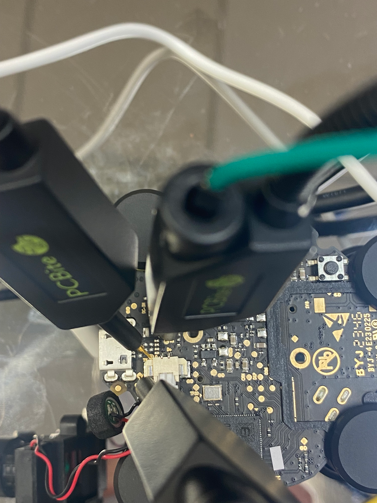
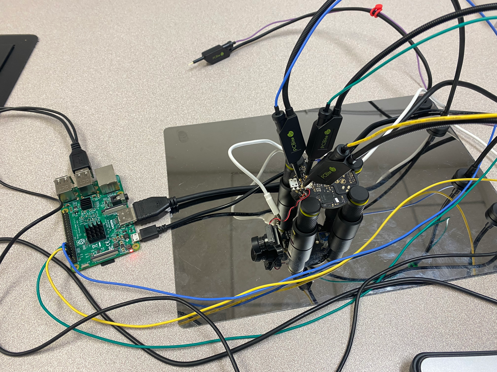

# Hardware

## UART
Pictures of the front and back of the board:

The board has two test point pads labeled "TX" and "RX" next to the micro USB port. These, plus one of the nearby "GND" pins, can be used to connect to the board's UART interface.

[boot.txt](./resources/boot.txt) contains the boot text received from UART. 